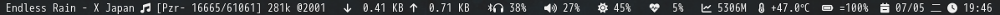

# dwmblocks

Modular status bar for dwm written in c.

## Screenshot



## Modifying blocks

The statusbar is made from text output from commandline programs.  Blocks are
added and removed by editing the config.h file.

## My own build

I modified some code for the sake of my needs, such as mpd status, network speed indicator. I used to use shell scripts for generate some info, but i decided to wirite C snippet with some C api for dissatisfaction with some lack of info.For expmple, i need to wash version of low bitrate songs, mpc status cannot show current playing's bitrate, though it doesn't make much sense for others. At least i can learn some C code, LOL.

## Changes

Source code is modified from [Suckless.org dwmblocks](https://dwm.suckless.org/status_monitor/).

Description below is extracted from [LukeSmithxyx](https://github.com/LukeSmithxyz/dwmblocks)'s github READMEA:

```text
Most statusbars constantly rerun every script every several seconds to update.
This is an option here, but a superior choice is giving your module a signal
that you can signal to it to update on a relevant event, rather than having it
rerun idly.

For example, the audio module has the update signal 10 by default.  Thus,
running `pkill -RTMIN+10 dwmblocks` will update it.
You can also run `kill -44 $(pidof dwmblocks)` which will have the same effect,
but is faster.  Just add 34 to your typical signal number.
My volume module *never* updates on its own, instead I have this command run
along side my volume shortcuts in dwm to only update it when relevant.

Note that all modules must have different signal numbers.
```

I add a func pointer in last of block's sctruct so it can run c func in plugin folder.
